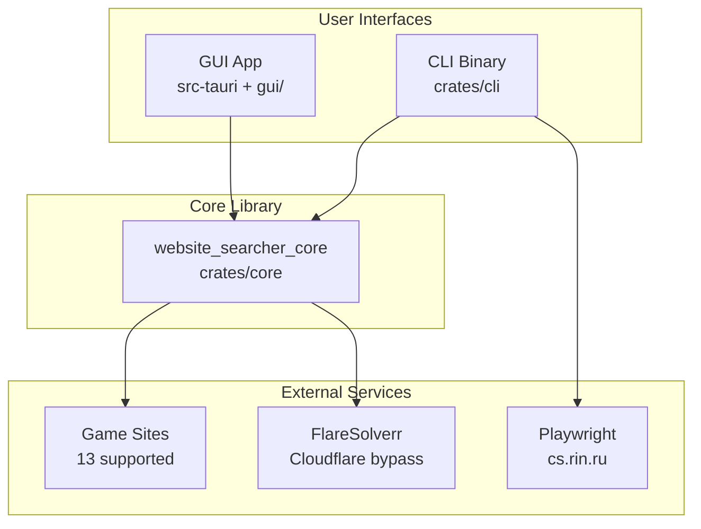
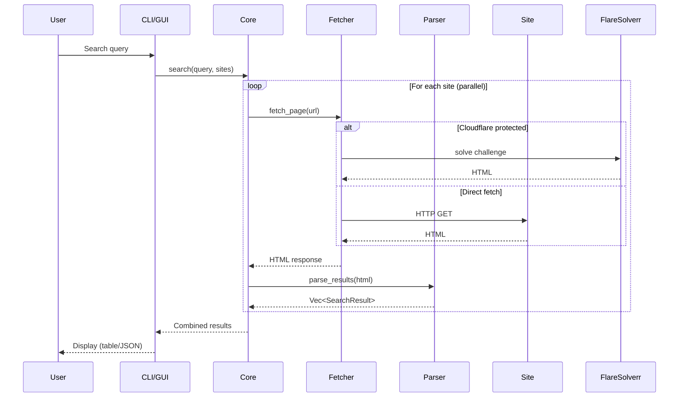

# Architecture

Website-Searcher is a cross-platform application for searching multiple game download sites in parallel. It consists of a Rust workspace with three main crates plus a React frontend.

## Workspace Structure

```
website-searcher/
├── crates/
│   ├── core/          # Shared library - scraping, parsing, fetching
│   └── cli/           # CLI application with TUI
├── src-tauri/         # Tauri backend (Rust)
├── gui/               # React + TypeScript frontend
├── scripts/           # Helper scripts (Playwright, aliases)
├── quickstart.py      # Prerequisites installer
└── compile.py         # Build and packaging script
```

## Component Diagram



## Core Library Modules

The `website_searcher_core` crate (`crates/core/src/`) contains:

| Module | Purpose |
|--------|---------|
| `lib.rs` | Public exports |
| `models.rs` | Data types: `SearchResult`, `SiteConfig`, `SearchKind` |
| `config.rs` | Site configurations for all 13 supported sites |
| `query.rs` | URL building and query normalization |
| `fetcher.rs` | HTTP fetching with retry/backoff logic |
| `parser.rs` | HTML parsing and result extraction |
| `cf.rs` | FlareSolverr integration for Cloudflare bypass |
| `output.rs` | Table/JSON formatting utilities |

## Data Flow



## Search Strategies (SearchKind)

The `SearchKind` enum defines how each site is searched:

| Variant | Description | Example |
|---------|-------------|---------|
| `QueryParam` | URL query parameter (`?s=query`) | fitgirl, steamrip |
| `FrontPage` | Parse homepage, filter locally | elamigos |
| `PathEncoded` | Query in URL path (`/search/query`) | ankergames |
| `ListingPage` | Use predefined listing URL | f95zone |
| `PhpBBSearch` | phpBB forum search with keywords param | csrin |

## SiteConfig Structure

Each site is defined with a `SiteConfig`:

```rust
pub struct SiteConfig {
    pub name: &'static str,              // Identifier (e.g., "fitgirl")
    pub base_url: &'static str,          // Base URL
    pub search_kind: SearchKind,         // How to search
    pub query_param: Option<&'static str>, // Query parameter name
    pub listing_path: Option<&'static str>, // Fallback listing URL
    pub result_selector: &'static str,   // CSS selector for results
    pub title_attr: &'static str,        // How to get title (text/attr)
    pub url_attr: &'static str,          // How to get URL (href)
    pub requires_js: bool,               // Needs JavaScript
    pub requires_cloudflare: bool,       // Needs FlareSolverr
}
```

## GUI Architecture

The GUI uses Tauri 2.x with a React frontend:

- **Backend** (`src-tauri/`): Rust binary that wraps `website_searcher_core`
- **Frontend** (`gui/`): React 19 + TypeScript + Vite 7
- **Communication**: Tauri IPC commands defined in `src-tauri/src/lib.rs`
- **Sidecar**: CLI binary bundled as external executable for advanced features

## Concurrency Model

- HTTP requests use `tokio` async runtime
- Parallel site fetching with `FuturesUnordered`
- Semaphore limits concurrent requests to 3
- Each site fetch is independent; failures don't block others

## Error Handling

- `anyhow` for CLI error context
- `thiserror` for library error types
- Graceful degradation: if one site fails, others continue
- Debug mode (`--debug`) writes HTML samples for troubleshooting
